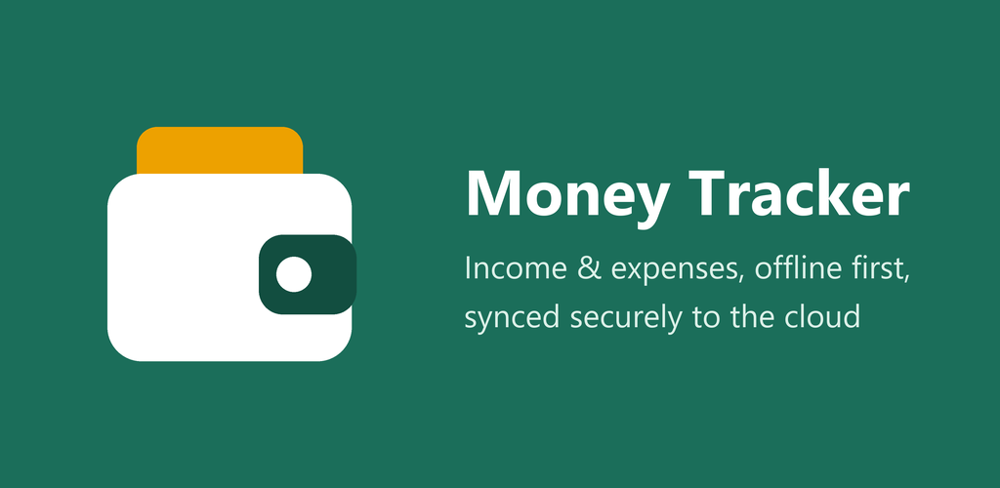

# Personal Money Tracker

Track income and expenses offline. Syncs securely across your devices. Free Android app.

## Download

**[Download the latest APK](https://github.com/NaveenKumarRaja/personal-money-tracker/releases/latest/download/personal-money-tracker.apk)** (Android 7.0+)

Website: https://naveenkumarraja.github.io/personal-money-tracker/

## Install

1. Download the APK on your Android phone.
2. Open it. If asked, allow **Install unknown apps** for your browser or Files app.
3. Tap **Install**, open **Personal Assistant**, and create an account.

To update, install the newer APK over the old one. Your data is kept.

## Privacy

[Privacy policy](https://naveenkumarraja.github.io/personal-money-tracker/privacy-policy.html) ·
Contact: naveenk090199+moneytracker@gmail.com

This repository only hosts the app downloads and website. The source code is private.
